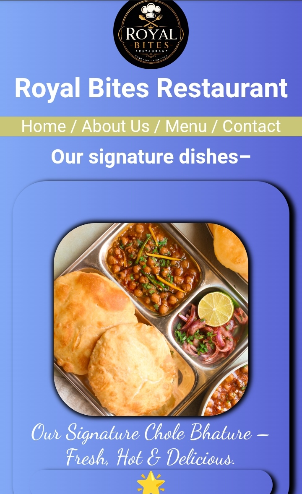
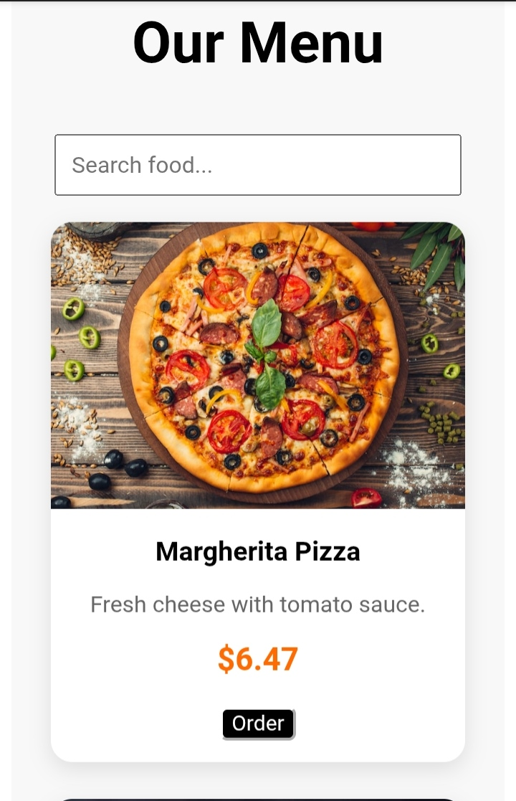
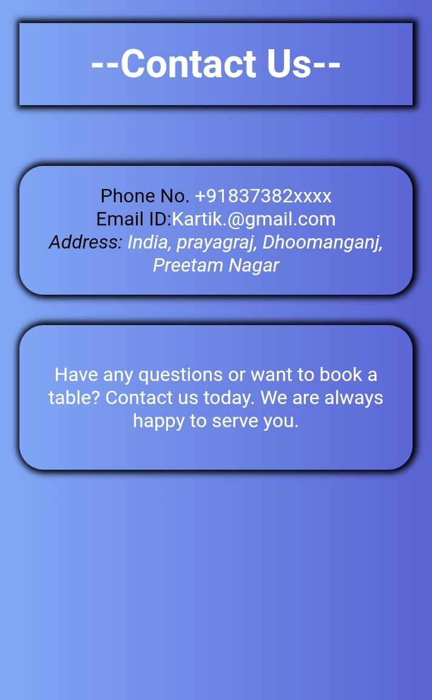
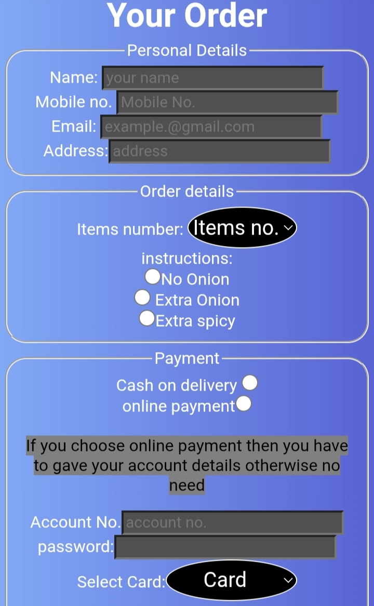

# Resturent-Website-

# 🍽️ Restaurant Website

<div align="center">

<h3>✨ A modern restaurant website built with HTML & CSS ✨</h3>


</div>

## 📌 About The Project

Welcome to my Restaurant Website project!  
This is a frontend website designed to showcase a restaurant's menu, food items, and ordering section with a clean and attractive user interface.

## 🚀 Features

✅ Beautiful restaurant landing page  
✅ Food menu showcase  

✅ Order section 

✅About section

✅Menu section with search bar

✅ Contact section

✅ Clean UI design  
✅ Built with pure HTML & CSS  

## 🛠️ Technologies Used


## 📸 Preview






## 🌐 Live Demo

🔗 [View Website](YOUR-LIVE-LINK)

## 📂 Project Structure

```text
Restaurant-Website/
│
├── index.html
├── style.css
├── order.html
└── Images/

📝 Note
This is a frontend-only project created for learning and practice purposes.
👨‍💻 Author
Kartik Kushwaha
⭐ If you like this project, consider giving it a star!